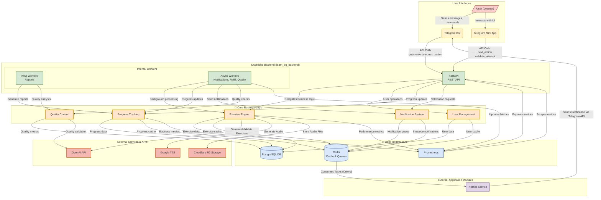

```mermaid
graph TD
    subgraph "User Interfaces"
        U[/"User (Learner)"/]
        TB(Telegram Bot)
        TMA(Telegram Mini App)
    end

    subgraph "DuoNiche Backend (learn_bg_backend)"
        direction LR
        subgraph "Internal Workers"
            direction TB
            W_ARQ[ARQ Workers <br> Reports]
            W_Async[Async Workers <br> Notifications, Refill, Quality]
        end
        API[FastAPI <br> REST API]
    end

    subgraph "🎯 Core Business Logic"
        direction LR
        CORE_EX[Exercise Engine]
        CORE_USR[User Management]
        CORE_PROG[Progress Tracking]
        CORE_NOTIF[Notification System]
        CORE_QUAL[Quality Control]
    end

    subgraph "External Services & APIs"
        direction LR
        OAI[OpenAI API]
        G_TTS[Google TTS]
        CF_R2[Cloudflare R2 Storage]
    end

    subgraph "External Application Modules"
        direction LR
        Notifier(Notifier Service)
    end

    subgraph "Core Infrastructure"
        direction LR
        DB[(PostgreSQL DB)]
        Cache[(Redis <br> Cache & Queues)]
        Metrics[Prometheus]
    end

    %% User to Frontend Flow
    U -- "Sends messages, commands" --> TB
    U -- "Interacts with UI" --> TMA

    %% Frontend to Backend Flow
    TB -- "API Calls <br> get/create user, next_action" --> API
    TMA -- "API Calls <br> next_action, validate_attempt" --> API

    %% Backend to Core Logic
    API -- "Delegates business logic" --> CORE_EX
    API -- "User operations" --> CORE_USR
    API -- "Progress updates" --> CORE_PROG
    API -- "Notification requests" --> CORE_NOTIF
    W_Async -- "Background processing" --> CORE_EX
    W_Async -- "Progress updates" --> CORE_PROG
    W_Async -- "Send notifications" --> CORE_NOTIF
    W_Async -- "Quality checks" --> CORE_QUAL
    W_ARQ -- "Generate reports" --> CORE_PROG
    W_ARQ -- "Quality analysis" --> CORE_QUAL

    %% Core to Infrastructure
    CORE_EX -- "Exercise data" --> DB
    CORE_USR -- "User data" --> DB
    CORE_PROG -- "Progress data" --> DB
    CORE_NOTIF -- "Notification queue" --> Cache
    CORE_QUAL -- "Quality metrics" --> DB

    CORE_EX -- "Exercise cache" --> Cache
    CORE_USR -- "User cache" --> Cache
    CORE_PROG -- "Progress cache" --> Cache

    %% Core to External Services
    CORE_EX -- "Generate/Validate Exercises" --> OAI
    CORE_EX -- "Generate Audio" --> G_TTS
    CORE_EX -- "Store Audio Files" --> CF_R2
    CORE_QUAL -- "Quality validation" --> OAI

    %% Core to External Modules
    CORE_NOTIF -- "Enqueue notifications" --> Cache
    Cache -- "Consumes Tasks (Celery)" --> Notifier
    Notifier -- "Sends Notification via Telegram API" --> TB

    %% Monitoring
    API -- "Exposes /metrics" --> Metrics
    W_Async -- "Updates Metrics" --> Metrics
    CORE_EX -- "Performance metrics" --> Metrics
    CORE_PROG -- "Business metrics" --> Metrics
    Metrics -- "Scrapes metrics" --> API

    %% Style Definitions
    classDef backend fill:#D5E8D4,stroke:#82B366,stroke-width:2px
    classDef core fill:#FFE6CC,stroke:#D79B00,stroke-width:3px
    classDef external_app fill:#E1D5E7,stroke:#9673A6,stroke-width:2px
    classDef external_api fill:#F5B7B1,stroke:#D35400,stroke-width:2px
    classDef infra fill:#DAE8FC,stroke:#6C8EBF,stroke-width:2px
    classDef ui fill:#FFF2CC,stroke:#D6B656,stroke-width:2px
    classDef actor fill:#F8CECC,stroke:#B85450,stroke-width:2px

    class API,W_ARQ,W_Async backend
    class CORE_EX,CORE_USR,CORE_PROG,CORE_NOTIF,CORE_QUAL core
    class Notifier external_app
    class OAI,G_TTS,CF_R2 external_api
    class DB,Cache,Metrics infra
    class TB,TMA ui
    class U actor
```